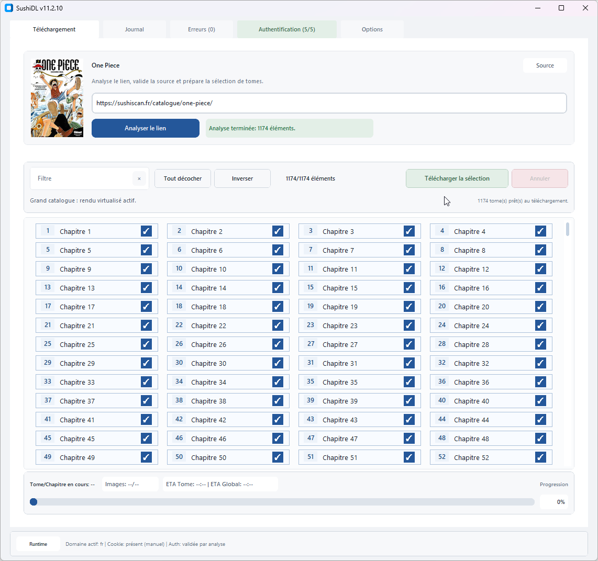
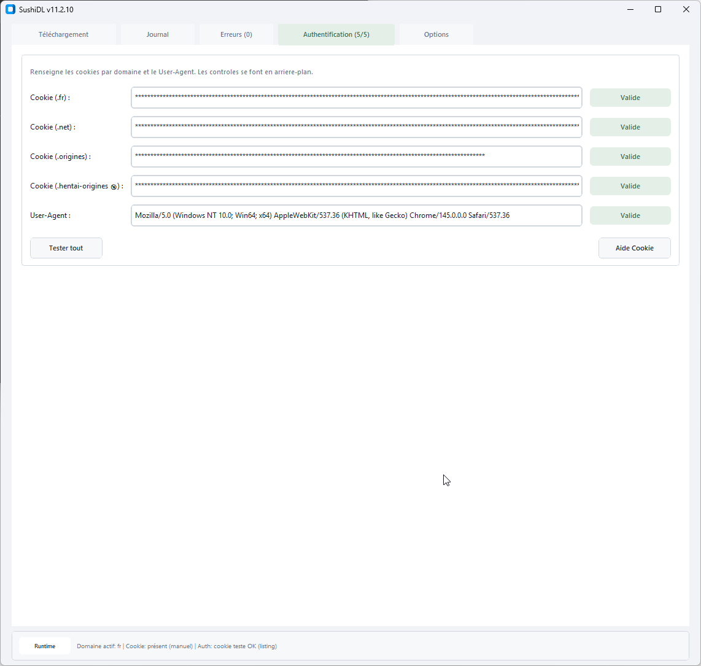
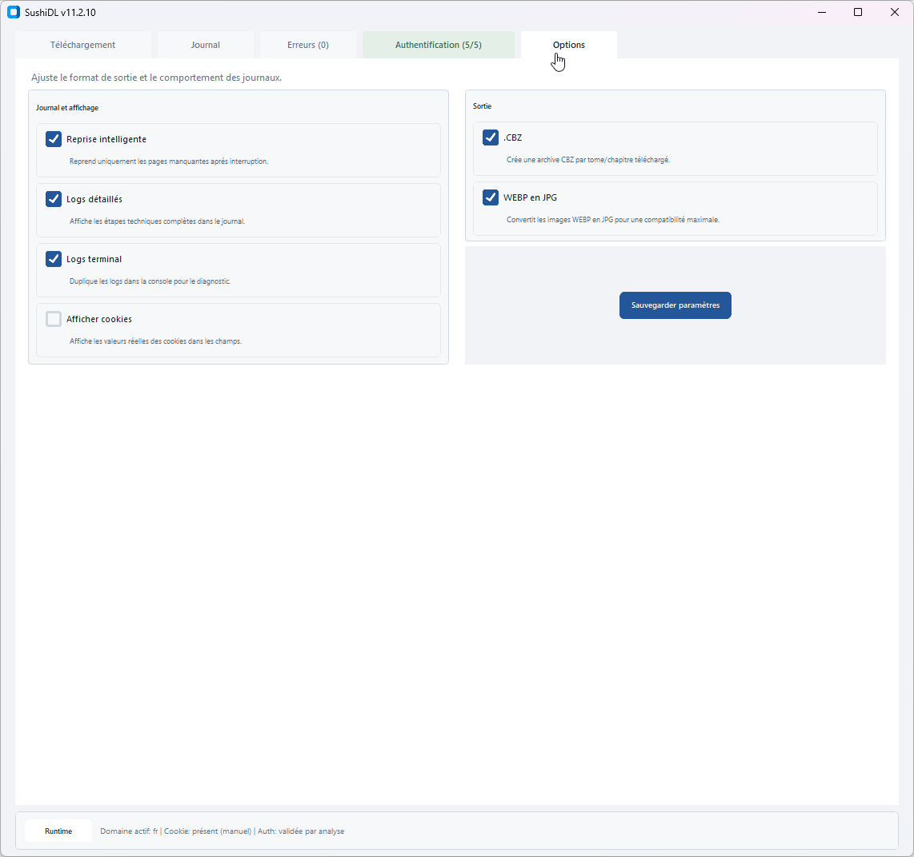
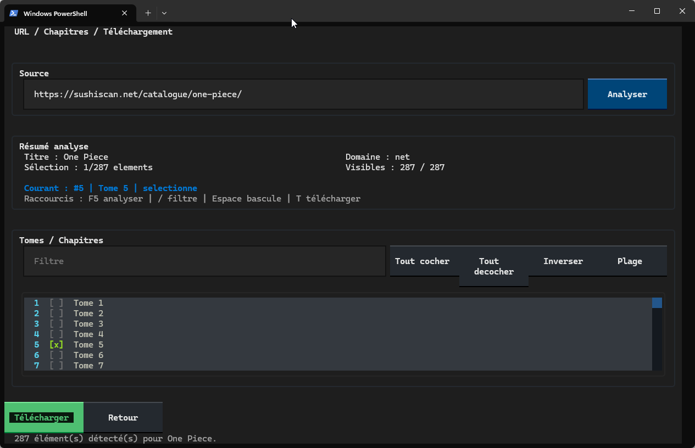

<p align="center">
  
</p>

# SushiDL

SushiDL est une application Python avec interface graphique Tkinter / CustomTkinter pour analyser et telecharger des chapitres ou tomes de mangas depuis plusieurs domaines compatibles, avec gestion manuelle de l'authentification Cloudflare, telechargement multi-thread, conversion d'images et creation d'archives CBZ.

## Resume

SushiDL cible un usage simple :
- renseigner les cookies et le `User-Agent`
- analyser une URL catalogue compatible
- selectionner les tomes ou chapitres
- telecharger les pages dans un dossier local
- generer des archives `.cbz` si souhaite

Version actuelle : `11.18.4`

## Ce qui change sur `main`

La branche `main` embarque maintenant la refonte `CustomTkinter` par defaut.

Concretement :
- nouvelle interface avec barre d'onglets unique :
  - `Telechargement`
  - `Journal`
  - `Erreurs`
  - `Authentification`
  - `Options`
- onglet `Telechargement` unifie :
  - source,
  - liste des tomes / chapitres,
  - barre d'actions,
  - progression runtime
- rendu dense optimise et virtualise pour les gros catalogues
- popup de preview rapide `3 a 5` pages depuis le listing
- indicateurs de chargement pendant l'analyse, le rendu de liste et la preview
- generation optionnelle de `ComicInfo.xml` dans les archives CBZ pour Komga
- telechargement plus sobre en memoire avec ecriture directe sur disque
- cache session des URLs d'images pour eviter les extractions repetees
- progression GUI moins bavarde pour garder l'interface fluide
- ralentissement automatique des threads sur erreurs serveur/rate-limit
- support Scan-Manga avec analyse catalogue, métadonnées, preview et téléchargement CBZ
- récupération des images Scan-Manga exclusivement via Playwright pour contourner le blocage Cloudflare des URLs `data*.scan-manga.com` et `cdn.scan-manga.com`
- support CrunchyScan et Scan-Hentai avec cookies dédiés, analyse catalogue, couvertures et téléchargement CBZ
- récupération CrunchyScan / Scan-Hentai via Playwright obligatoire : le lecteur expose des blobs chiffrés générés côté navigateur, donc SushiDL réutilise une session navigateur unique au lieu de tenter des téléchargements directs lents et bruyants
- Playwright CrunchyScan / Scan-Hentai est invisible pendant les téléchargements; seul le repli manuel ouvre le navigateur habituel après une détection Cloudflare
- lecteur CrunchyScan / Scan-Hentai renforcé : chargement explicite des pages lazy et renouvellement ciblé du contexte navigateur après un échec transitoire
- métadonnées CrunchyScan / Scan-Hentai complétées dans `ComicInfo.xml` : auteurs et artistes
- journal Playwright détaillé pour Scan-Manga, CrunchyScan et Scan-Hentai : session, analyse lecteur, détection et récupération des images
- lorsqu'un challenge Cloudflare CrunchyScan / Scan-Hentai est détecté, SushiDL bascule vers un mode manuel clair : la page est ouverte dans le navigateur habituel, puis le cookie `cf_clearance` validé doit être collé avant relance
- diagnostic lecteur CrunchyScan / Scan-Hentai enrichi : absence de blobs et erreurs JavaScript de la page sont distinguées dans le journal
- détection Cloudflare du lecteur CrunchyScan / Scan-Hentai prioritaire, sans attendre inutilement le chargement des images
- validation Turnstile du lecteur signalée explicitement : la validation et le renouvellement du cookie se font dans le navigateur de l'utilisateur
- validation assistée CrunchyScan / Scan-Hentai : validation dans l'unique fenêtre Chrome persistante de SushiDL, puis relance sans recoller de cookie
- lecteur CrunchyScan / Scan-Hentai : session Chrome Playwright persistante et visible, réutilisée entre les chapitres pour conserver la validation Cloudflare
- longs chapitres CrunchyScan / Scan-Hentai : préchargement lazy glissant et limité, progression Playwright visible et timeout local sur les blobs lents
- lecteur CrunchyScan / Scan-Hentai absent ou bloqué : détection rapide et ouverture automatique de la fenêtre Chrome de validation
- logs `[perf]` pour mesurer analyse, extraction, telechargement et archive
- cache disque des analyses catalogue avec raccourci `Ctrl+R` pour forcer le rafraîchissement
- préflight avec plan de téléchargement avant lancement
- diagnostic cookie plus détaillé dans les popups de renouvellement
- renouvellement cookie directement dans la popup, sans quitter l'onglet `Téléchargement`
- collage sécurisé dans le champ URL : SushiDL extrait l'URL catalogue depuis un texte bruité et refuse les contenus non texte
- profils “site fragile” configurables via `config.json`
- nombre de telechargements paralleles configurable dans `Options`
- `requirements.txt` inclut maintenant :
  - `customtkinter>=5.2.2`
  - `playwright>=1.52.0`
  - `textual>=0.82.0`

## Mode terminal

`main` embarque maintenant aussi une interface terminal interactive basee sur `Textual`.

Objectif :
- utiliser SushiDL sans GUI
- piloter les cookies, l'analyse, la selection et le telechargement uniquement au clavier
- garder une interface dense mais lisible sur gros catalogues

Lancement :

```bash
python SushiDL.py --cli
```

Fonctionnalites CLI disponibles :
- menu principal terminal
- ecran `Options / Cookies`
- edition et test des cookies par domaine
- edition du `User-Agent`
- sauvegarde des options runtime
- ecran `URL / Chapitres / Telechargement`
- analyse d'URL reelle via le backend existant
- filtre texte dans la liste
- selection / deselection / inversion
- selection par plage (`1-20`, `50+`, `1,4,7`, etc.)
- telechargement terminal reel avec progression
- annulation du telechargement
- ecran d'erreurs dedie
- copie et export des erreurs
- aides contextuelles et modales de confirmation
- adaptation partielle aux terminaux plus petits avec mode compact et avertissement de taille

Mode terminal non interactif :

```bash
python SushiDL.py --cli --url "https://sushiscan.net/catalogue/one-piece/" --range 1-10 --download --output "D:\Mangas"
```

Options utiles :
- `--url` : ajoute une URL catalogue a traiter, repetable
- `--url-file` : charge une liste d'URLs depuis un fichier texte
- `--range` : selectionne une plage (`all`, `1-20`, `50+`, `1,4,7`)
- `--download` : lance le telechargement
- `--dry-run` : analyse et affiche la selection sans telecharger
- `--no-comicinfo`, `--no-cover`, `--no-cbz`, `--no-webp2jpg`, `--no-resume` : desactive une option de sortie
- `--threads 1-8` : ajuste le nombre de telechargements paralleles

Navigation terminal :
- `Tab` / `Shift+Tab` : changer de zone
- `Fleches` ou `J/K` : naviguer
- `Entree` / clic souris : selectionner ou activer
- `Espace` : basculer la ligne courante dans la liste
- `F5` : lancer l'analyse
- `/` : focus filtre
- `A` : tout cocher
- `N` : tout decocher
- `I` : inverser
- `R` : selection par plage
- `T` : telecharger
- `Esc` : retour
- `Q` : quitter
- `H` : aide

Dependance supplementaire :
- `textual>=0.82.0`

## Apercu visuel

Captures d'ecran :

<p align="center">
  
  
</p>
<p align="center">
  
  
</p>

## Nouveautes recentes

### 11.16.4
- CrunchyScan / Scan-Hentai :
  - fallback canvas quand `fetch(blob:)` échoue dans le contexte navigateur,
  - export JPEG depuis l'image déjà rendue par le lecteur.

### 11.16.3
- CrunchyScan / Scan-Hentai :
  - correction d'une extraction lancée trop tôt quand le lecteur exposait déjà `data-meta` mais pas encore les balises image,
  - attente explicite des images du lecteur avant comptage,
  - diagnostic détaillé en cas de lecteur vide.

### 11.16.2
- CrunchyScan / Scan-Hentai :
  - correction de l'injection Playwright des cookies saisis sous forme de valeur brute `cf_clearance`,
  - attente plus robuste du lecteur avant extraction des blobs,
  - message d'erreur explicite si Cloudflare bloque la page chapitre `/read/...`.

### 11.16.1
- CrunchyScan / Scan-Hentai :
  - correction de l'extraction ComicInfo pour la date de sortie,
  - correction de l'extraction du statut,
  - correction de l'extraction des genres et du type.

### 11.16.0
- Nouveaux sites :
  - support de `crunchyscan.fr`,
  - support de `scan-hentai.net`,
  - cookies et tests d'authentification dédiés dans l'onglet `Authentification`,
  - extraction des couvertures depuis le moteur commun CrunchyScan / Scan-Hentai.
- Lecteur :
  - téléchargement des images via Playwright pour lire les blobs du lecteur,
  - réutilisation d'une session Chromium unique pour limiter les fenêtres/processus ouverts.

### 11.15.39
- Scan-Manga :
  - séparation visuelle des catalogues `Webtoon X` comme les `Tome X`,
  - affichage compact des chapitres webtoon en `W1 C12` pour éviter les retours à la ligne.

### 11.15.38
- Interface :
  - liste des tomes/chapitres rendue en canvas virtualisé pour tous les catalogues,
  - suppression du rendu widgets pour les vues `Dense`, `Confort` et les petits catalogues,
  - mode `Confort` porté sur canvas avec une grille plus aérée,
  - libellés de statut adaptés au rendu canvas permanent.

### 11.15.37
- Suivi :
  - ajout d'un onglet `Suivi` pour gérer les catalogues surveillés,
  - ajout de l'URL courante ou d'une URL manuelle dans `watchlist.json`,
  - vérification manuelle d'un catalogue ou de toute la liste sans téléchargement,
  - affichage du dernier état connu, du nombre d'éléments et des nouveautés détectées,
  - mise à jour du cache d'analyse après une vérification fraîche.

### 11.15.36
- Interface :
  - rendu virtualisé des catalogues Scan-Manga groupés par tome,
  - réduction des artefacts visuels lors des navigations rapides dans la liste des chapitres,
  - rafraîchissement canvas mieux cadencé pendant le scroll rapide,
  - cache du découpage virtuel des tomes pour limiter les recalculs,
  - nettoyage plus strict des éléments canvas lors des rechargements et changements de vue.

### 11.15.35
- Suivi :
  - ajout de `catalog_state.json` pour mémoriser durablement l'état connu des catalogues entre deux démarrages,
  - comparaison automatique après chaque analyse pour signaler les nouveaux chapitres/tomes,
  - base `watchlist.json` préparée pour le futur planificateur.

### 11.15.34
- Couvertures :
  - correction des couvertures Scan-Manga dont le suffixe numérique fait partie de l'URL réelle,
  - sélection plus prudente de la meilleure variante téléchargée selon la taille réelle de l'image.

### 11.15.33
- Interface :
  - virtualisation plus agressive des gros catalogues,
  - traitement UI par lots plus courts pour rendre la main plus vite,
  - compactage des logs répétitifs pendant les téléchargements bavards.
- Scan-Manga :
  - preview Novel limitée à une page et réutilisation du cache de rendu,
  - annulation plus réactive pendant l'extraction des pages Scan-Manga.
- Couvertures :
  - meilleure sélection depuis `srcset`, métadonnées sociales et attributs lazy-load,
  - tentative prudente de variante haute résolution avec fallback automatique.

### 11.15.32
- Scan-Manga :
  - preview des chapitres Novel en générant uniquement la première page texte en image,
  - la fenêtre de preview sait maintenant afficher les pages internes `sushidl-textpage://`.

### 11.15.31
- Scan-Manga :
  - correction des deux-points et ponctuations de fin de ligne dans le rendu Novel,
  - rendu des symboles Novel (`☆☆☆`, `◇`, chiffres cerclés) avec police de secours,
  - centrage par défaut des images intégrées au texte Novel.

### 11.15.30
- Scan-Manga :
  - correction de la détection Novel sur les pages live dont le HTML est mal imbriqué autour des balises `<br>`,
  - le téléchargement réel ne retombe plus à tort sur le parseur lecteur image `idc/sml/sme`.

### 11.15.29
- Scan-Manga :
  - rendu Novel plus lisible avec police serif, espacements HTML et paragraphes mieux séparés,
  - évite les pages de titre seules quand le contenu peut continuer sur la même page.

### 11.15.28
- Scan-Manga :
  - validation sur un vrai chapitre Novel contenant une image intégrée,
  - chargement des images Novel depuis les exports HTML locaux en plus des URLs web.

### 11.15.27
- Scan-Manga :
  - les images présentes dans les chapitres Novel sont intégrées au rendu CBZ avec le texte,
  - support des images relatives, lazy-load et `srcset` dans le contenu `.ln_c_content`.

### 11.15.26
- Scan-Manga :
  - rendu Novel plus fidèle au HTML source avec conservation des blocs centrés,
  - police Unicode plus complète pour éviter les caractères manquants dans les pages générées.

### 11.15.25
- Scan-Manga :
  - support des chapitres Novel en texte : le contenu est rendu en pages JPG puis archivé en CBZ,
  - évite les erreurs de téléchargement quand un lecteur Scan-Manga ne fournit pas d'images.

### 11.15.24
- Interface :
  - affichage compact des chapitres Scan-Manga dans la grille (`T9 C4-1`, `T9 CEx2`) pour tenir sur une seule ligne,
  - les labels internes, le filtre, le téléchargement et les noms CBZ restent inchangés.

### 11.15.23
- Scan-Manga :
  - affichage GUI raccourci (`Tome 4 - Chap 34-1`) sans titre long,
  - nom CBZ conservant le titre complet quand il est disponible,
  - cache d'analyse invalidé pour recalculer les métadonnées d'archive.

### 11.15.22
- Scan-Manga :
  - format de label plus compact pour les chapitres volumés : `Tome 4 - Chap 34-1`,
  - conservation des tirets de sous-chapitres pour distinguer rapidement les parties `-1`, `-2`, `-3`,
  - cache d'analyse invalidé pour recalculer les labels.

### 11.15.21
- Interface :
  - les séparateurs par tome Scan-Manga deviennent adaptatifs : ils sont affichés sur les listes raisonnables, mais la virtualisation est conservée sur les très gros catalogues pour éviter les freezes,
  - amélioration de la réactivité lors du rendu et du scroll des grosses listes de chapitres.

### 11.15.20
- Scan-Manga :
  - les noms de chapitres conservent maintenant le titre complet quand il est affiché sur la page,
  - la grille GUI sépare visuellement les chapitres par tome pour les catalogues Scan-Manga volumineux,
  - le cache d'analyse est invalidé pour recalculer les labels complets.

### 11.15.19
- Scan-Manga :
  - les chapitres listés dans des volumes sont nommés `Tome X - Chapitre Y` pour éviter les collisions de CBZ,
  - les labels ambigus comme `Chapitre Extra` conservent leur détail quand il est présent sur la page,
  - le cache d'analyse est invalidé pour recalculer les nouveaux noms.

### 11.15.18
- Interface :
  - correction du titre tronqué dans la fenêtre `File d'attente`.

### 11.15.17
- Scan-Manga :
  - recyclage du contexte Playwright aussi entre les tentatives d'une même image quand le CDN renvoie un blocage,
  - réduction des blocages en chaîne sur les chapitres téléchargés à la suite.

### 11.15.16
- Scan-Manga :
  - recyclage automatique du contexte Playwright quand le téléchargement passe à un autre chapitre,
  - stabilisation des téléchargements en série sans ouvrir plusieurs sessions Chrome.

### 11.15.15
- Scan-Manga :
  - validation automatique de l'avertissement lecteur dans la session Playwright avant la récupération des images,
  - stabilisation des téléchargements de chapitres avertis quand plusieurs chapitres se suivent.

### 11.15.14
- Scan-Manga :
  - correction de l'extraction des URLs d'images sur les chapitres avec avertissement public averti,
  - l'appel API lecteur est isolé de la session de navigation pour éviter les réponses `HTTP 500` après affichage de l'avertissement.

### 11.15.13
- Interface :
  - journal GUI inséré par lots pour limiter les micro-freezes pendant les téléchargements bavards,
  - file d'actions UI traitée avec un budget temps court pour rendre la main plus vite à Tkinter,
  - progression, ETA et détails d'images regroupés et ignorés quand leur valeur ne change pas,
  - filtre de chapitres légèrement différé pour garder la saisie fluide sur gros catalogues.

### 11.15.12
- Scan-Manga :
  - ajout d'un second chemin Playwright via le contexte navigateur quand `fetch` échoue sur certaines images CDN.
  - validation des images même quand le CDN ne renvoie pas de `content-type`.

### 11.15.11
- Scan-Manga :
  - ajout de `cdn.scan-manga.com` dans les hôtes image obligatoirement récupérés via Playwright.

### 11.15.10
- Scan-Manga :
  - une seule session Playwright est réutilisée pour les images et previews afin d'éviter l'ouverture de nombreuses fenêtres Chrome en parallèle.

### 11.15.9
- Scan-Manga :
  - correction de l'erreur Playwright `cannot switch to a different thread` quand la preview et le téléchargement utilisent des threads différents.

### 11.15.8
- Scan-Manga :
  - invalidation automatique des anciens caches d'analyse pour éviter les métadonnées `ComicInfo.xml` vides après mise à jour du parseur.

### 11.15.7
- Scan-Manga :
  - support des URLs catalogue `https://www.scan-manga.com/<id>/<titre>.html`,
  - téléchargement et preview des images uniquement via Playwright,
  - relances navigateur plus robustes quand le lecteur coupe la récupération après quelques pages,
  - extraction corrigée des métadonnées `ComicInfo.xml` depuis la fiche technique.

### 11.15.6
- Scan-Manga :
  - ajout du domaine `.scanmanga` dans l'onglet Authentification,
  - analyse catalogue et récupération des URLs d'images via le lecteur Scan-Manga.

### 11.15.1
- Interface :
  - simplification de la popup `Cookie à renouveler`,
  - suppression du bouton `Aller à Authentification` car l'onglet est déjà ouvert automatiquement.

### 11.15.0
- Analyse :
  - ajout d'un cache disque des catalogues analyses avec TTL configurable (`analysis_cache_ttl_seconds`),
  - `Ctrl+R` force une analyse fraîche sans utiliser le cache.
- Téléchargement :
  - ajout d'un préflight avant lancement avec sélection, CBZ déjà présents, premium ignorés, espace disque, sorties et threads,
  - ajout de profils `fragile_sites` dans `config.json` pour limiter automatiquement threads et délai entre volumes.
- Diagnostic :
  - les popups cookie affichent maintenant domaine, URL de test, User-Agent et présence du cookie,
  - le journal affiche un résumé performance après traitement.

### 11.14.1
- Correction :
  - une analyse catalogue bloquée par un cookie expiré propose maintenant la mise à jour du cookie,
  - après confirmation, SushiDL relance automatiquement l'analyse une seule fois pour éviter les boucles.

### 11.14.0
- Robustesse / rapidite :
  - reduction automatique du nombre de telechargements paralleles en cas d'erreurs serveur, timeout ou rate-limit,
  - reprise intelligente au point d'arret apres ralentissement automatique,
  - relance cookie plus prudente avec 1 thread de securite apres mise a jour du cookie.
- Diagnostic :
  - ajout de logs `[perf]` pour mesurer les etapes analyse catalogue, couverture, extraction images, telechargement images, archive CBZ et volume complet.

### 11.13.0
- Rapidite :
  - ajout d'un cache session pour les URLs d'images par chapitre/tome,
  - les previews reutilisent le cache quand disponible et ne demandent que les premieres pages utiles,
  - les mises a jour de progression GUI sont regroupees pour soulager le thread interface pendant les gros telechargements.

### 11.12.0
- Performance :
  - les images sont maintenant ecrites en flux vers des fichiers temporaires `.part`, puis validees avant renommage,
  - le cache de preview est limite et les images de preview sont redimensionnees pour reduire l'usage memoire,
  - les GIF de couverture sont plafonnes en nombre de frames pour eviter les pics memoire.
- Options :
  - ajout du reglage `Telechargements paralleles` dans l'onglet `Options`,
  - ajout de l'option CLI batch `--threads 1-8`.

### 11.11.2
- ComicInfo.xml :
  - le champ `Publisher` utilise maintenant un editeur detecte si disponible,
  - sinon il stocke la source complete (`sushiscan.fr`, `sushiscan.net`, `toonfr.com`, etc.) au lieu d'un alias court (`fr`, `net`).

### 11.11.1
- ComicInfo.xml :
  - quand l'option est activee, SushiDL propose maintenant de verifier/modifier les metadonnees avant de lancer la creation des CBZ.

### 11.11.0
- Workflow :
  - ajout d'une file d'attente GUI pour traiter plusieurs URLs catalogue a la suite,
  - ajout d'un mode CLI non interactif pour automatiser analyse et telechargement.
- ComicInfo.xml :
  - ajout d'un editeur de metadonnees en GUI avant telechargement.
- Robustesse :
  - generation d'un `SushiDL_report.txt` dans les CBZ finalises avec pages manquantes ou invalides.

### 11.10.0
- Sortie CBZ :
  - ajout d'une option `Couverture chapitres`,
  - la couverture de la fiche est ajoutee en page `000_cover.jpg` uniquement pour les CBZ de chapitres,
  - les CBZ de tomes complets ne sont pas modifies,
  - l'option est disponible en GUI et en mode terminal.

### 11.9.5
- ComicInfo.xml :
  - correction de l'extraction des genres Manga-Origines via les liens `/manga-genres/`.

### 11.9.4
- ComicInfo.xml :
  - ajout de l'extraction des genres ToonFR via les liens `/webtoon-genre/`.

### 11.9.3
- ComicInfo.xml :
  - generalisation de l'extraction des genres sur `.fr`, `.net`, Origines, Hentaizone et OrtegaScans,
  - prise en charge des blocs `genres-content`, `manga-genre` et des liens Ortega `?tags=`.

### 11.9.2
- ComicInfo.xml :
  - correction de l'extraction du genre sur `.net`,
  - prise en charge du bloc cible `.seriestugenre` sans reprendre les tags globaux de page.

### 11.9.1
- ComicInfo.xml :
  - correction de l'extraction des genres pour eviter les tags globaux de la page,
  - le resume visible complet est maintenant prefere aux metas HTML tronquees,
  - ajout de la lecture des tables HTML classiques pour mieux recuperer auteur, dessinateur, annee et genre.

### 11.9.0
- ComicInfo.xml :
  - enrichissement automatique avec les metadonnees detectees sur la fiche catalogue,
  - prise en charge de `Summary`, `Year`, `Month`, `Day`, `Writer`, `Penciller`, `Translator`, `Genre`, `Publisher`, `Tags` et `ScanInformation`,
  - extraction best effort depuis les metas HTML, les blocs WordPress/Madara, les liens de genre et les donnees embarquees Ortega.

### 11.8.0
- Sortie CBZ :
  - ajout d'une option `ComicInfo.xml` dans l'onglet `Options`,
  - generation de metadonnees compatibles Komga dans chaque archive CBZ,
  - champs inclus selon les donnees disponibles : serie, titre, numero, nombre de pages, URL source, langue et tags.
- Mode terminal :
  - l'option `ComicInfo.xml` est aussi disponible dans `Options / Cookies`.

### 11.7.2
- Telechargement :
  - correction d'un retry inutile sur les pages renvoyant un contenu non image,
  - ces pages sont maintenant marquees comme invalides/ignorees immediatement,
  - la finalisation du `CBZ` conserve les chapitres avec pages valides.
- Hentaizone :
  - support complet du catalogue, des chapitres et des images `scanscloud.xyz`,
  - validation cookie dediee depuis la GUI et le mode terminal.

### Resume des versions precedentes
- Interface `CustomTkinter` par defaut avec onglet `Telechargement` unifie.
- Mode terminal interactif via `python SushiDL.py --cli`.
- Support recent de Toonfr, OrtegaScans et Hentaizone.
- Preview rapide des chapitres/tomes avec popup dediee.
- Rendu dense virtualise pour gros catalogues et filtre rapide.
- Reprise intelligente, erreurs detaillees, relance cookie sur blocage et logs plus lisibles.

Pour le detail complet des versions : voir `CHANGELOG.md`.

## Sites supportes

- `https://sushiscan.fr`
- `https://sushiscan.net`
- `https://mangas-origines.fr`
- `https://hentai-origines.fr`
- `https://toonfr.com`
- `https://ortegascans.fr`
- `https://hentaizone.xyz`

Formats d'URL catalogue attendus :
- `https://sushiscan.fr/catalogue/<slug>/`
- `https://sushiscan.net/catalogue/<slug>/`
- `https://mangas-origines.fr/oeuvre/<slug>/`
- `https://hentai-origines.fr/manga/<slug>/`
- `https://toonfr.com/webtoon/<slug>/`
- `https://ortegascans.fr/serie/<slug>/`
- `https://hentaizone.xyz/manga/<slug>/`

## Fonctionnalites principales

- Authentification manuelle par cookies `cf_clearance` et `User-Agent`.
- Champs separes par domaine pour `.fr`, `.net`, `.origines`, `.hentai-origines`, `.toonfr`, `.ortegascans` et `.hentaizone`.
- Pour `.toonfr`, tu peux coller soit `cf_clearance`, soit un header `Cookie` complet si le site devient plus strict.
- Pour `.ortegascans`, tu peux coller soit `cf_clearance`, soit un header `Cookie` complet.
- Detection automatique du domaine a utiliser pour les pages, images et couvertures.
- Telechargement multi-thread des images avec retries et classification des erreurs.
- Annulation possible pendant l'execution.
- Reprise intelligente sur les pages deja presentes.
- Conversion optionnelle WebP vers JPG.
- Creation optionnelle d'archives CBZ.
- Generation optionnelle de `ComicInfo.xml` compatible Komga dans les archives CBZ.
- Journal unifie GUI + terminal avec filtres.
- Tableau d'erreurs par tome avec raison technique et action recommande.
- Interface `CustomTkinter` avec onglet `Telechargement` unifie et rendu dense optimise.
- Affichage optimise des tres grands catalogues avec filtre rapide, rendu mutualise sur canvas et scroll stabilise.
- Preview rapide integree par chapitre/tome via popup dediee et loupe dans le listing.
- Normalisation automatique des libelles `Episode` / `Ep` / `Chapter` vers `Chapitre`.
- Mode terminal interactif `--cli` avec gestion des cookies, analyse, selection, telechargement et erreurs.
- Sauvegarde persistante des parametres dans `cookie_cache.json`.

## Prerequis

- Python 3.10 ou plus
- Dependances Python de `requirements.txt`
- Tkinter disponible dans l'installation Python

Verification rapide :

Sous Windows :

```bash
python --version
```

Sous Linux (Debian/Ubuntu) :

```bash
sudo apt update
sudo apt install python3 python3-pip python3-tk
python3 --version
```

## Installation

```bash
git clone https://github.com/itanivalkyrie/SushiDL.git
cd SushiDL
pip install -r requirements.txt
```

Si `pip` ne pointe pas vers la bonne version de Python, utilise `python -m pip install -r requirements.txt` ou `python3 -m pip install -r requirements.txt`.

Dependances Python actuelles :
- `beautifulsoup4>=4.13.4`
- `customtkinter>=5.2.2`
- `curl_cffi>=0.10.0`
- `Pillow>=11.3.0`
- `playwright>=1.52.0`
- `requests>=2.32.3`
- `textual>=0.82.0`

## Lancement

Sous Windows :

```bash
python SushiDL.py
```

Mode terminal interactif :

```bash
python SushiDL.py --cli
```

Sous Linux :

```bash
python3 SushiDL.py
```

Mode terminal interactif :

```bash
python3 SushiDL.py --cli
```

## Authentification manuelle

SushiDL fonctionne en mode manuel pour l'authentification.
Le flux principal n'utilise pas FlareSolverr ni import automatique des cookies depuis le navigateur. Exception importante : Scan-Manga utilise Playwright pour récupérer les images et les previews, car les URLs `data*.scan-manga.com` et `cdn.scan-manga.com` sont bloquées en accès HTTP direct.

Tu dois fournir :
- un cookie `cf_clearance` pour chaque domaine que tu veux utiliser
- un `User-Agent` valide

Procedure conseillee :
1. Ouvre le site cible dans ton navigateur habituel.
2. Passe le challenge Cloudflare si necessaire.
3. Recupere la valeur du cookie `cf_clearance` sur le domaine concerne.
4. Recupere le `User-Agent` du navigateur.
5. Colle les valeurs dans l'onglet d'authentification de SushiDL.
6. Sauvegarde les parametres.

Lien pratique pour recuperer le `User-Agent` :
- `https://httpbin.org/user-agent`

### Note Scan-Manga

Pour Scan-Manga, SushiDL analyse le catalogue et le lecteur avec les cookies et le `User-Agent` renseignés, puis récupère les images via un contexte Playwright réutilisé. Le téléchargement direct des images est volontairement ignoré pour ce domaine afin d'éviter les erreurs 403 répétées et les pertes de temps.

Chrome installé sur la machine est utilisé en priorité. Si Playwright signale qu'aucun navigateur compatible n'est disponible, installe le navigateur Chromium fourni par Playwright :

```bash
python -m playwright install chromium
```

## Configuration

Fichiers utilises par l'application :
- `config.json` : configuration globale et liens d'aide
- `cookie_cache.json` : preferences utilisateur, cookies, user-agent, options runtime

Exemple de structure `config.json` :

```json
{
  "auth_mode": "manual",
  "manual_links": {
    "cookie_fr": "https://sushiscan.fr",
    "cookie_net": "https://sushiscan.net",
    "cookie_origines": "https://mangas-origines.fr",
    "cookie_hentai": "https://hentai-origines.fr",
    "user_agent": "https://httpbin.org/user-agent",
    "cookie_help": "https://github.com/itanivalkyrie/SushiDL?tab=readme-ov-file#-recuperer-user-agent-et-cf_clearance"
  }
}
```

## Utilisation

Workflow standard :
1. Lance `SushiDL.py`.
2. Renseigne les cookies et le `User-Agent`.
3. Colle une URL catalogue supportee.
4. Clique sur `Analyser le lien`.
5. Controle la liste detectee.
6. Selectionne les tomes ou chapitres souhaites.
7. Clique sur `Telecharger la selection`.
8. Choisis le dossier de destination.

## Sortie des fichiers

Par defaut, les telechargements sont ranges dans `DL SushiScan/`, sauf si tu choisis un autre dossier de sortie pendant le telechargement.

Structure typique :

```text
<dossier_sortie>/
  <titre_manga>/
    <titre_manga> - <tome_ou_chapitre>.cbz
```

Si le mode CBZ est desactive, les images sont conservees dans des dossiers par tome ou chapitre.

## Gestion des erreurs

SushiDL distingue plusieurs familles d'erreurs :
- `404` / `410` : page absente cote serveur
- `403`, `429`, `5xx` : blocage, rate limit, erreur serveur ou probleme reseau
- page HTML a la place d'une image : challenge ou protection cote site

L'interface remonte aussi un tableau d'erreurs par tome avec :
- etape concernee
- code HTTP
- raison technique
- action conseillee

## Conseils de depannage

- `HTTP 403` : verifie le cookie `cf_clearance` du bon domaine et le `User-Agent`.
- Liste vide : controle le format de l'URL source et le domaine actif.
- Retry frequent sur images : renouvelle les donnees d'authentification ou attends avant de relancer.
- Couverture ou pages non chargees : controle que le cookie correspond bien au domaine de l'URL analysee.

## Outils complementaires

Le depot contient aussi :
- `tools/remove_last_images_cbz.py` : nettoyage automatique des dernieres pages parasites d'un CBZ
- `cut_sushiscan_fr/` : scripts annexes de coupe / reconstruction d'images

## Structure du projet

- `SushiDL.py` : application principale
- `README.md` : documentation generale
- `CHANGELOG.md` : historique des versions
- `requirements.txt` : dependances Python
- `assets/` : visuels et captures
- `tools/` : scripts utilitaires

## Changelog

Historique complet des versions : `CHANGELOG.md`

## Support

Si le projet t'est utile, tu peux soutenir le mainteneur sur Ko-fi :
- https://ko-fi.com/itanivalkyrie
