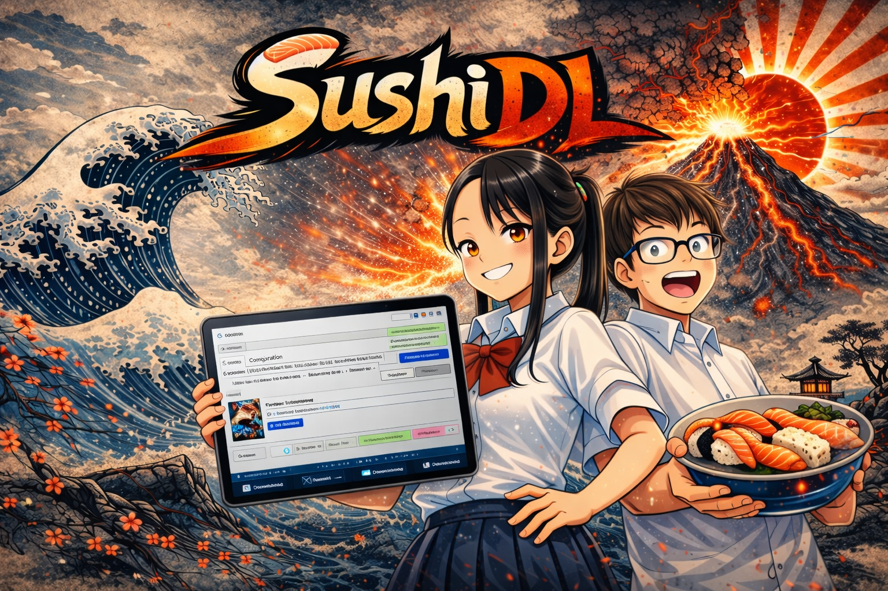

<p align="center">
  
</p>

# SushiDL

SushiDL est une application Python avec interface graphique Tkinter / CustomTkinter pour analyser et telecharger des chapitres ou tomes de mangas depuis plusieurs domaines compatibles, avec gestion manuelle de l'authentification Cloudflare, telechargement multi-thread, conversion d'images et creation d'archives CBZ.

## Resume

SushiDL cible un usage simple :
- renseigner les cookies et le `User-Agent`
- analyser une URL catalogue compatible
- selectionner les tomes ou chapitres
- telecharger les pages dans un dossier local
- generer des archives `.cbz` si souhaite

Version actuelle : `11.2.9`

## Nouveautes recentes

### 11.2.9
- Refonte visuelle `CustomTkinter` vers un rendu plus sobre, plus lisible et plus homogene.
- Onglets `Journal / Authentification / Options` et `Tomes / Chapitres / Erreurs` harmonises avec un vrai comportement de notebook.
- Toolbar de selection compactee:
  - compteur fusionne (`1/1000 elements`),
  - controle `Auto / Dense / Confort` plus lisible,
  - meilleure integration du filtre, des actions et du bloc telechargement.
- Support optimise des gros catalogues:
  - mode liste legere automatique sur tres grandes listes,
  - virtualisation des widgets visibles,
  - filtres quasi instantanes,
  - switches de vue plus fluides.
- Analyse decouplee du rendu UI pour eviter les timeouts quand la liste contient un tres grand nombre d'elements.

### 11.2.8
- Acceleration du flux de telechargement par suppression des attentes artificielles dans les boucles workers.
- Annulation plus reactive pendant les retries d'extraction des images.
- Timeout de securite ajoute sur les appels UI synchrones (`run_on_ui(wait=True)`).
- Reduction de la contention entre threads dans les logs.
- Sanitation stricte des valeurs de cookies et du header `Cookie` avant les requetes HTTP.
- Probe de validation cookie force sur des URLs fixes de demarrage par domaine.

Pour le detail complet des versions : voir `CHANGELOG.md`.

## Sites supportes

- `https://sushiscan.fr`
- `https://sushiscan.net`
- `https://mangas-origines.fr`
- `https://hentai-origines.fr`

Formats d'URL catalogue attendus :
- `https://sushiscan.fr/catalogue/<slug>/`
- `https://sushiscan.net/catalogue/<slug>/`
- `https://mangas-origines.fr/oeuvre/<slug>/`
- `https://hentai-origines.fr/manga/<slug>/`

## Fonctionnalites principales

- Authentification manuelle par cookies `cf_clearance` et `User-Agent`.
- Champs separes par domaine pour `.fr`, `.net`, `.origines` et `.hentai-origines`.
- Detection automatique du domaine a utiliser pour les pages, images et couvertures.
- Telechargement multi-thread des images avec retries et classification des erreurs.
- Annulation possible pendant l'execution.
- Reprise intelligente sur les pages deja presentes.
- Conversion optionnelle WebP vers JPG.
- Creation optionnelle d'archives CBZ.
- Journal unifie GUI + terminal avec filtres.
- Tableau d'erreurs par tome avec raison technique et action recommande.
- Branche `CustomTkinter` avec interface plus sobre, compteurs fusionnes et vues de liste adaptatives (`Auto`, `Dense`, `Confort`).
- Affichage optimise des tres grands catalogues avec filtre rapide et rendu virtualise.
- Sauvegarde persistante des parametres dans `cookie_cache.json`.

## Prerequis

- Python 3.10 ou plus
- Dependances Python de `requirements.txt`
- Tkinter disponible dans l'installation Python

Verification rapide :

Sous Windows :

```bash
python --version
```

Sous Linux (Debian/Ubuntu) :

```bash
sudo apt update
sudo apt install python3 python3-pip python3-tk
python3 --version
```

## Installation

```bash
git clone https://github.com/itanivalkyrie/SushiDL.git
cd SushiDL
pip install -r requirements.txt
```

Si `pip` ne pointe pas vers la bonne version de Python, utilise `python -m pip install -r requirements.txt` ou `python3 -m pip install -r requirements.txt`.

## Lancement

Sous Windows :

```bash
python SushiDL.py
```

Sous Linux :

```bash
python3 SushiDL.py
```

## Authentification manuelle

SushiDL fonctionne en mode manuel pour l'authentification.
Le flux principal n'utilise pas FlareSolverr, Playwright, ni import automatique des cookies depuis le navigateur.

Tu dois fournir :
- un cookie `cf_clearance` pour chaque domaine que tu veux utiliser
- un `User-Agent` valide

Procedure conseillee :
1. Ouvre le site cible dans ton navigateur habituel.
2. Passe le challenge Cloudflare si necessaire.
3. Recupere la valeur du cookie `cf_clearance` sur le domaine concerne.
4. Recupere le `User-Agent` du navigateur.
5. Colle les valeurs dans l'onglet d'authentification de SushiDL.
6. Sauvegarde les parametres.

Lien pratique pour recuperer le `User-Agent` :
- `https://httpbin.org/user-agent`

## Configuration

Fichiers utilises par l'application :
- `config.json` : configuration globale et liens d'aide
- `cookie_cache.json` : preferences utilisateur, cookies, user-agent, options runtime

Exemple de structure `config.json` :

```json
{
  "auth_mode": "manual",
  "manual_links": {
    "cookie_fr": "https://sushiscan.fr",
    "cookie_net": "https://sushiscan.net",
    "cookie_origines": "https://mangas-origines.fr",
    "cookie_hentai": "https://hentai-origines.fr",
    "user_agent": "https://httpbin.org/user-agent",
    "cookie_help": "https://github.com/itanivalkyrie/SushiDL?tab=readme-ov-file#-recuperer-user-agent-et-cf_clearance"
  }
}
```

## Utilisation

Workflow standard :
1. Lance `SushiDL.py`.
2. Renseigne les cookies et le `User-Agent`.
3. Colle une URL catalogue supportee.
4. Clique sur `Analyser`.
5. Controle la liste detectee.
6. Selectionne les tomes ou chapitres souhaites.
7. Clique sur `Telecharger`.
8. Choisis le dossier de destination.

## Sortie des fichiers

Par defaut, les telechargements sont ranges dans `DL SushiScan/`, sauf si tu choisis un autre dossier de sortie pendant le telechargement.

Structure typique :

```text
<dossier_sortie>/
  <titre_manga>/
    <titre_manga> - <tome_ou_chapitre>.cbz
```

Si le mode CBZ est desactive, les images sont conservees dans des dossiers par tome ou chapitre.

## Gestion des erreurs

SushiDL distingue plusieurs familles d'erreurs :
- `404` / `410` : page absente cote serveur
- `403`, `429`, `5xx` : blocage, rate limit, erreur serveur ou probleme reseau
- page HTML a la place d'une image : challenge ou protection cote site

L'interface remonte aussi un tableau d'erreurs par tome avec :
- etape concernee
- code HTTP
- raison technique
- action conseillee

## Conseils de depannage

- `HTTP 403` : verifie le cookie `cf_clearance` du bon domaine et le `User-Agent`.
- Liste vide : controle le format de l'URL source et le domaine actif.
- Retry frequent sur images : renouvelle les donnees d'authentification ou attends avant de relancer.
- Couverture ou pages non chargees : controle que le cookie correspond bien au domaine de l'URL analysee.

## Outils complementaires

Le depot contient aussi :
- `tools/remove_last_images_cbz.py` : nettoyage automatique des dernieres pages parasites d'un CBZ
- `cut_sushiscan_fr/` : scripts annexes de coupe / reconstruction d'images
- `legacy_scripts/SushiDL_V9.py` : ancienne version conservee pour reference

## Structure du projet

- `SushiDL.py` : application principale
- `README.md` : documentation generale
- `CHANGELOG.md` : historique des versions
- `requirements.txt` : dependances Python
- `assets/` : visuels et captures
- `tools/` : scripts utilitaires

## Changelog

Historique complet des versions : `CHANGELOG.md`

## Support

Si le projet t'est utile, tu peux soutenir le mainteneur sur Ko-fi :
- https://ko-fi.com/itanivalkyrie
